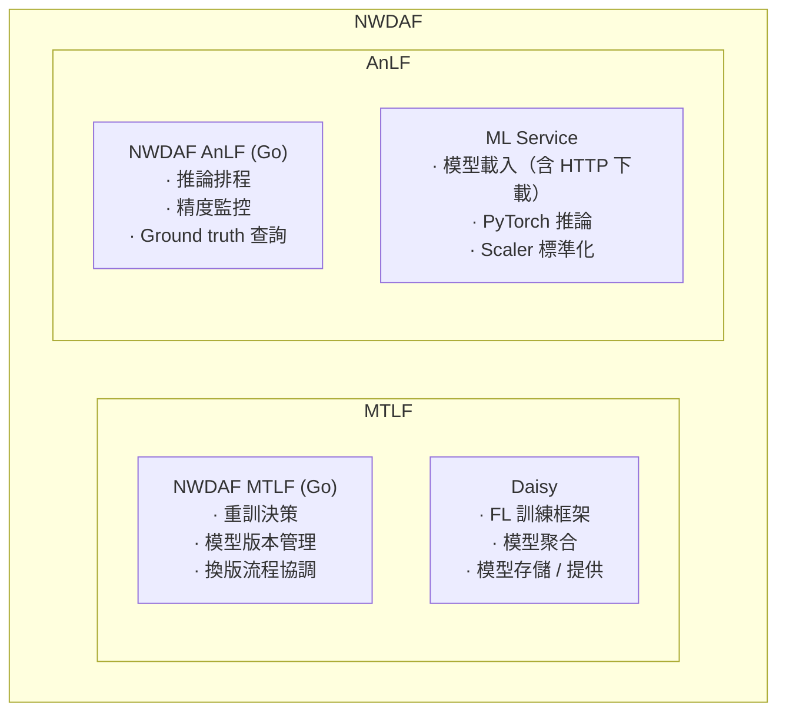
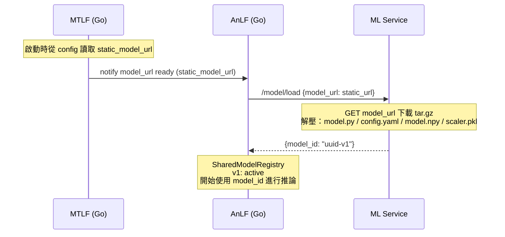
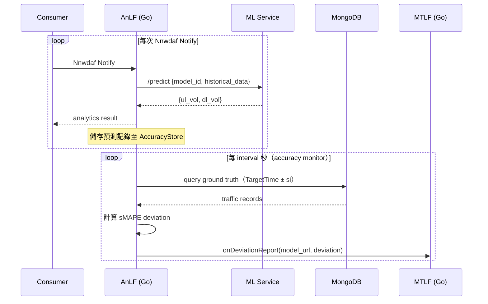
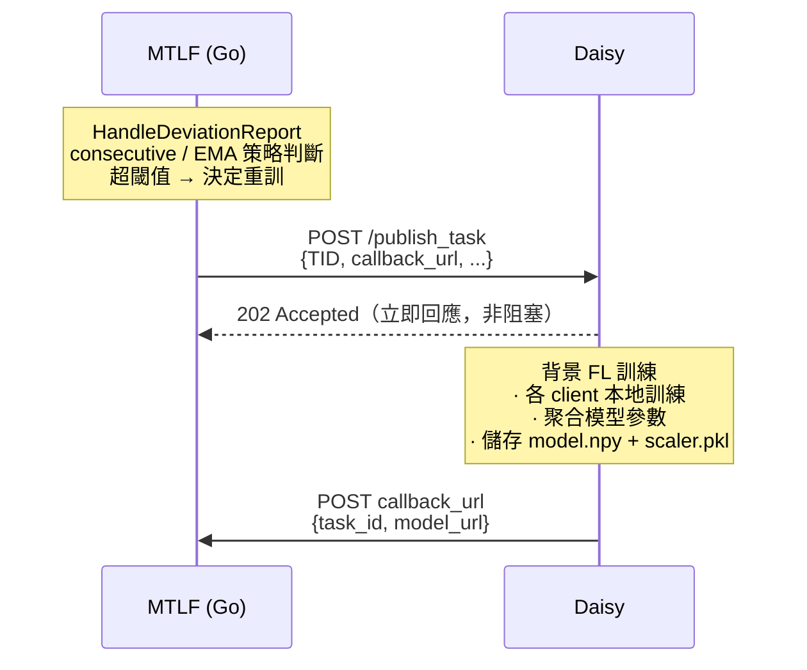
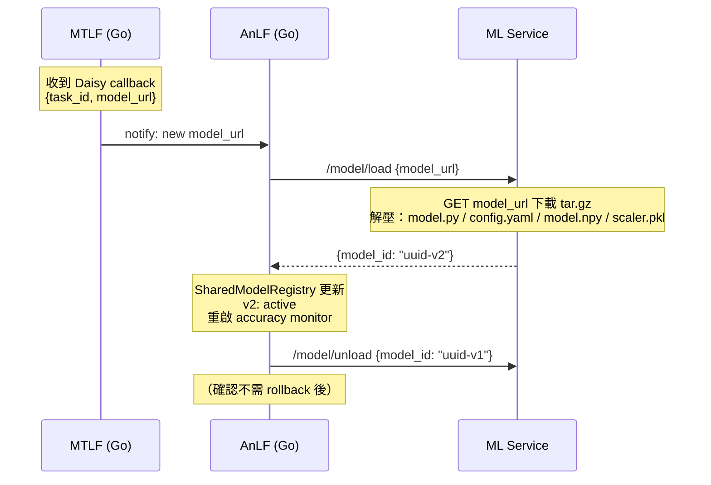
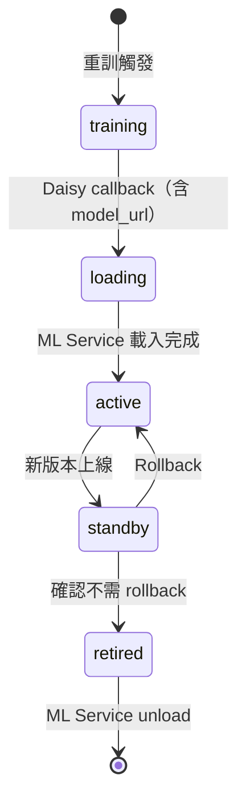
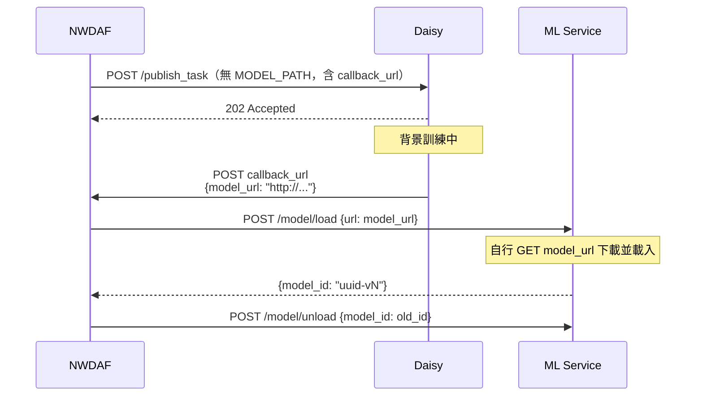

# Daisy ↔ NWDAF

## MTLF / AnLF 元件對應

### 元件架構



### 元件職責摘要

| 元件 | 隸屬 | 職責 |
|------|------|------|
| NWDAF MTLF (Go) | MTLF | 重訓決策（閾值策略）、協調 Daisy 與 ML Service、模型版本 registry、換版流程 |
| Daisy | MTLF | FL 訓練執行、模型聚合、訓練完後 serve 模型檔案、非同步 callback |
| NWDAF AnLF (Go) | AnLF | 推論排程、預測記錄儲存、sMAPE 計算、ground truth 查詢、向 MTLF 回報精度 |
| ML Service | AnLF | 模型載入（HTTP 下載）、PyTorch 推論、Scaler 標準化、多模型並存管理 |

---

## 互動流程

### Phase 1｜初始模型部署



### Phase 2｜穩態推論 + 精度監控



### Phase 3｜重訓決策與執行



### Phase 4｜模型換版



---

## 模型管理

### 生命週期



### SharedModelRegistry — key 設計調整

目前 `SharedModelRegistry` 以 model URL（file path）為 key，改成 Daisy 提供 HTTP URL 後仍可運作，但無法支援多版本並存（active / standby）。

改為以 **series ID** 為 key，URL 下放到版本記錄內：

```
key: series_id（穩定，不隨重訓改變，例如 "ue-comm-group1"）
value:
  versions:
    - version: 1, url: "http://daisy/.../v1.npy", status: standby, model_id: "uuid-1"
    - version: 2, url: "http://daisy/.../v2.npy", status: active,  model_id: "uuid-2"
```

影響範圍：
- `NWDAFContext.sharedModels` map key 從 URL 改為 series ID
- `SharedModelInfo` 結構調整，加入版本列表與 status
- `MlModelInfo.ModelUrl` 改為 `SeriesId`，URL 改由 MTLF 查版本記錄取得
- `training.go` / `trigger.go` / `monitor.go` 傳遞的 model 識別子跟著改

### ModelAccuracyStore — 維持現有設計

`ModelAccuracyStore` 繼續以**版本**為單位隔離，換版時刪除舊 store、建立新 store 是設計預期：每個新版本模型的精度監控應從零開始，不繼承舊版本的狀態（warmup、breach counter、EMA 均重置）。

---

## 實作變更項目

### Daisy — `server_api_handler.py`

- `publish_task` route：將 `receive_task` 移到 background thread 執行，立即回 `{"task_id": TID}` + 202
- background thread 訓練結束後，POST `callback_url`（從 task payload 讀取）帶上 `{task_id, model_url}`
- 新增 `GET /model/<filename>` endpoint，serve 訓練完存下來的模型檔案（tar.gz）
- 打包邏輯：從 task payload 讀 `MODEL_DEF` / `MODEL_CONFIG` 路徑，連同 `model.npy` / `scaler.pkl` 一起打包成 `model/<TID>.tar.gz`
- `app.run()` 加上 `threaded=True`（Flask 預設 single-thread，不加的話 callback 之前進來的 request 會卡住）
- `MODEL_PATH`（如 `"model/model.npy"`）是 Daisy master **本地路徑**，FL 框架用它來載入初始模型權重（`_initialize_parameters`）及儲存訓練結果（`_save_parameters`），與 NWDAF 取得模型的機制無關
- callback 的 `model_url` 直接從 MODEL_PATH 推導：`http://<daisy-host>:<port>/model/<filename>`

**[提議] MODEL_PATH 命名方式**

目前 MODEL_PATH 固定為 `"model/model.npy"`，每次重訓會蓋掉同一個檔案，無法保留舊版本。

**背景**：`task_manager.receive_task` 用 `MODEL_PATH` 同時載入初始權重（input）和儲存訓練結果（output）。這個初始權重即為 FL 的 **global model 起始值**，分發給各 client 做本地訓練後聚合，因此每次重訓都是 warm start，從上一版訓練好的模型繼續，而非重頭隨機初始化。

**[提議] 固定 latest 路徑 + 訓練後複製至 TID 目錄**

- `MODEL_PATH` 維持固定值（`"model/model.npy"`），`task.json` 結構不需要改動，`task_manager.py` 也不需要改
- Daisy 訓練完、callback 發送前，`server_api_handler.py` 將結果打包成 tar.gz：

```
model/<TID>.tar.gz
  └── model.npy      ← 訓練產出（已有）
  └── scaler.pkl     ← 訓練產出（已有）
  └── model.py       ← 模型架構定義，已存在工作目錄，打包時直接收入
  └── config.yaml    ← 需要新建，手動維護，描述超參數與推論介面
```

**[提議] 架構定義透過 task key 指定（方案 B）**

`model.py` 和 `config.yaml` 是模型架構定義，不隨每次訓練改變，但需要可配置以支援未來架構迭代。

在 task.json 加入兩個 key，指向 Daisy 工作目錄內的路徑：

```json
{
  "MODEL_PATH":   "model/model.npy",
  "MODEL_DEF":    "arch/v1/model.py",
  "MODEL_CONFIG": "arch/v1/config.yaml"
}
```

- `server_api_handler.py` 打包時從 `MODEL_DEF` 和 `MODEL_CONFIG` 讀取，不 hardcode 路徑
- 檔案由 Daisy 負責人維護，放在工作目錄的 `arch/<version>/` 子目錄下，以 git 版本控制
- NWDAF config 的 `mtlf.task` 改指向新版本，即可在不動 Daisy code 的情況下切換架構
- `config.yaml` 目前尚未建立，需先按 Model 定義章節的格式補上，放入對應目錄
- callback 回傳的 `model_url` 即為該壓縮包的下載連結：`http://<daisy-host>:<port>/model/<TID>.tar.gz`
- ML Service 單一 GET 下載，解壓後以固定檔名讀取，原子性：要嘛全拿到要嘛失敗，不會有半套狀態

- 訓練行為不受影響：訓練本身全程在記憶體執行，複製步驟在訓練迴圈結束後才發生

> **限制**：`model/model.npy` 是共享的 latest 路徑，若同時有兩個 retrain 進行會有 race condition（互相覆蓋初始權重）。此設計**只允許同一時間執行一個 retrain**，NWDAF 的 `IsRetraining()` guard 已有此限制，需確保該 guard 在非同步 callback 架構下仍然有效。

> 需考慮磁碟清理策略：retired 後要不要刪除對應 TID 目錄，以及保留幾個版本。

> Daisy 是 submodule，改完需要另外在 Daisy repo commit。

### NWDAF Go — `internal/sbi/consumer/daisy_service.go`

- `TriggerTraining` 改為只發送 POST 不等待，return `(taskId string, error)`

### NWDAF Go — `internal/sbi/`（新增 callback endpoint）

- 新增 `POST /mtlf/training-complete` route，接收 Daisy 訓練完的 callback
- payload：`{"task_id": "...", "model_url": "http://..."}`
- handler 從 pending 狀態表查出對應的 `oldModelUrl` / `store` / `mtlfCfg`，觸發 `swapModelAfterRetrain`

### NWDAF Go — `internal/mtlf/training.go`

- `triggerTraining` 只負責發送 task，回傳 `task_id`
- 新增 in-flight 狀態表（`sync.Map`），`task_id` → `{oldModelUrl, store, mtlfCfg}`
    - `TriggerRetraining` 發完 task 後把對應資訊存入狀態表
    - callback endpoint 收到通知後從狀態表取出，再執行 `swapModelAfterRetrain`
- `swapModelAfterRetrain` 簽名加入 `newModelUrl string` 參數（從 callback payload 取得，不再從 task config 讀）
- **`swapModelAfterRetrain` 中直接呼叫 ML Service 的邏輯需要移除**：目前 `swapModelAfterRetrain`（line 104）直接呼叫 `mlClient.InitializeModel` / `mlClient.UnloadModel`，與 Phase 1 的初始化路徑（AnLF 負責呼叫 ML Service）不一致。改法：`swapModelAfterRetrain` 只更新 SharedModelRegistry 和訂閱狀態，實際的 load/unload 交由 AnLF 的 `InitializeMlModel` / `UnloadModel` 執行。可透過新增 `onModelSwapReady(newModelUrl, oldModelId string)` callback 由 MTLF 呼叫、AnLF 實作來解耦。

### NWDAF Go — `internal/mtlf/training.go`（初始化路徑）

- `runDelayedTraining`（startup trigger）目前在訓練完後也呼叫 `swapModelAfterRetrain`，同樣直接操作 ML Service
- 修正方向同上：改為通知 AnLF 載入 static_model_url，與 Phase 1 diagram 對齊

---

## Daisy 訓練完後，模型提供方式

- 目前的情況是
    - NWDAF 發一個 task(json) 給daisy後開始進行訓練
        - 訓練過程中會被HTTP阻塞在那邊等daisy回覆200
        - daisy訓練完畢後回傳200給NWDAF
        - NWDAF根據當初發的task裡面寫的位置(file path)
            - NWDAF把這個file path傳給ML service
            - ML service直接讀取這個path的檔案來替換模型
            - 然而目前是透過將這個file path設置成相對位置
                - 而且ML service讀取我們一開始就偷放的2號模型（已經在NWDAF那邊）
                - Daisy訓練完之後存起來的模型就不管了
                - 也可以說目前是hard code的形式
- 我們想改成的情況是
    - NWDAF 一樣發一個task給daisy後開始進行訓練
        - task 結構不變（MODEL_PATH 仍在，但那是 Daisy 內部用的本地路徑，NWDAF 不再讀它）
        - 訓練過程中不再阻塞，Daisy 立即回 202
        - daisy訓練完畢後透過 callback 通知NWDAF
            - 並且在body內附上一個模型下載點（URL）
        - NWDAF 收到 URL 之後轉發給 ML Service，由 ML Service 自行下載
        - 讀取並使用新的模型
    - **NWDAF(Go), Daisy, ML service 互動行為**



> 各元件責任清楚：Daisy 管訓練 + 存模型 + serve 檔案；NWDAF 只做協調，不碰模型本身；ML Service 管下載 + 載入 + 推論。

---

## Model 定義

將一個model的元素定義好，讓推論/訓練引擎可以用通用的方式進行初始化，也就是無論如何只要吃下這三個項目，就可以完成模型的使用，引擎本身不需要先定義一大堆東西。

主要是在(偽)model provision時可以將三者打包來使用，也就是可以直接從URL下載到這些東西。

- model.py
    - 模型的定義class
    - `model.py` 範例

        ```python
        import torch
        import torch.nn as nn
        from torch.nn.utils import weight_norm

        class Chomp1d(nn.Module):
            def __init__(self, chomp_size):
                super(Chomp1d, self).__init__()
                self.chomp_size = chomp_size

            def forward(self, x):
                return x[:, :, :-self.chomp_size].contiguous()

        class TemporalBlock(nn.Module):
            def __init__(self, n_inputs, n_outputs, kernel_size, stride, dilation, padding, dropout=0.2):
                super(TemporalBlock, self).__init__()
                self.conv1 = weight_norm(nn.Conv1d(n_inputs, n_outputs, kernel_size,
                                                   stride=stride, padding=padding, dilation=dilation))
                self.chomp1 = Chomp1d(padding)
                self.relu1 = nn.ReLU()
                self.dropout1 = nn.Dropout(dropout)

                self.conv2 = weight_norm(nn.Conv1d(n_outputs, n_outputs, kernel_size,
                                                   stride=stride, padding=padding, dilation=dilation))
                self.chomp2 = Chomp1d(padding)
                self.relu2 = nn.ReLU()
                self.dropout2 = nn.Dropout(dropout)

                self.net = nn.Sequential(self.conv1, self.chomp1, self.relu1, self.dropout1,
                                         self.conv2, self.chomp2, self.relu2, self.dropout2)
                self.downsample = nn.Conv1d(n_inputs, n_outputs, 1) if n_inputs != n_outputs else None
                self.relu = nn.ReLU()
                self.init_weights()

            def init_weights(self):
                self.conv1.weight.data.normal_(0, 0.01)
                self.conv2.weight.data.normal_(0, 0.01)
                if self.downsample is not None:
                    self.downsample.weight.data.normal_(0, 0.01)

            def forward(self, x):
                out = self.net(x)
                res = x if self.downsample is None else self.downsample(x)
                return self.relu(out + res)

        class TemporalConvNet(nn.Module):
            def __init__(self, num_inputs, num_channels, kernel_size=2, dropout=0.2):
                super(TemporalConvNet, self).__init__()
                layers = []
                num_levels = len(num_channels)
                for i in range(num_levels):
                    dilation_size = 2 ** i
                    in_channels = num_inputs if i == 0 else num_channels[i-1]
                    out_channels = num_channels[i]
                    layers += [TemporalBlock(in_channels, out_channels, kernel_size, stride=1, dilation=dilation_size,
                                             padding=(kernel_size-1) * dilation_size, dropout=dropout)]

                self.network = nn.Sequential(*layers)

            def forward(self, x):
                return self.network(x)

        class Model(nn.Module):
            """
            TCN model for traffic prediction.
            Input:  (batch, input_size=10, seq_length=30)  - channels first
            Output: (batch, output_size=2)                 - [ul_vol, dl_vol] for next step
            """
            def __init__(self, input_size, output_size, num_channels, kernel_size=2, dropout=0.2):
                super().__init__()
                self.tcn = TemporalConvNet(input_size, num_channels, kernel_size=kernel_size, dropout=dropout)
                self.linear = nn.Linear(num_channels[-1], output_size)

            def forward(self, x):
                # x: (batch, input_size, seq_length)
                y1 = self.tcn(x)
                # Take last timestep's features
                o = self.linear(y1[:, :, -1])
                return o
        ```

    - ML service載入的時候就直接 `from model import Model`
- config
    - 當作是model的info
    - 裡面放一些包括模型的超參數（可以直接用來建立class）
        - 上面的`model.py`裡面的定義：`model(input_size, output_size, num_channels)`
        - 以及一些部屬時需要使用到的資訊
            - 像是輸入時的feature name有哪些, input/output windows size等等
            - `config` 範例

                ```yaml
                # config 範例
                # 架構超參數（用來實例化 model.py）
                architecture:
                  input_size: 10
                  output_size: 2
                  num_channels: [32, 64, 64, 64]
                  kernel_size: 2
                  dropout: 0.2

                # 推論介面
                task_type: regression        # regression | classification
                input:
                  type: windowed_sequence    # windowed_sequence | flat_vector
                  features: [ul_vol, dl_vol, ...]
                  seq_length: 30             # 只有 windowed_sequence 需要
                output:
                  type: continuous           # continuous | categorical
                  fields: [ul_vol, dl_vol]   # regression 用
                  # classes: [low, mid, high]  # 假設未來有分類任務的話能像這樣擴充功能

                preprocessing:
                  normalize: true
                  scaler: scaler.pkl
                ...
                ```

- weight, scaler
    - 模型訓練完畢後的參數本身
    - 訓練時資料（訓練集）標準化所使用的平均值和標準差
- 整個模型就可以像這樣提供
