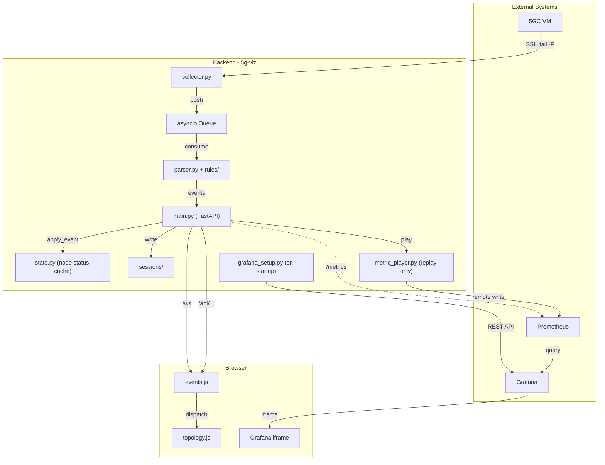
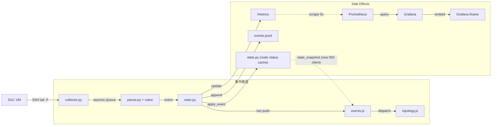
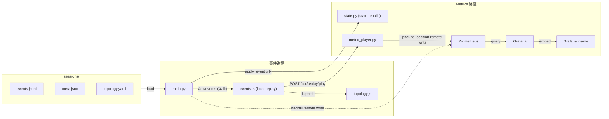

# 5g-viz 架構圖

> Historical note: this overview was written before the runtime was reorganized into `backend/`, `runtime/`, `services/`, and `replay/`, and before pseudo-live removal. Read it as a high-level historical architecture map, not a precise current module map.

本文用圖示呈現系統整體組件與兩條主要資料路徑。  
組件細節見 [system.md](system.md)；完整資料流說明見 [data-flow.md](data-flow.md)。

---

## 整體組件圖

> 虛線（`-.->`）表示 Prometheus 主動 scrape `/metrics`；實線為主動推送或直接呼叫。

---

## Live 模式資料流

左欄是事件的主路徑（log → 瀏覽器），右欄是每個事件產生的 side effects。

`state.py` 累積每個事件對 node 的影響（class 變化、nf_status），  
當新瀏覽器分頁建立 WebSocket 時，後端先送一份 `state_snapshot`，  
讓前端直接呈現當前拓樸狀態，不需從頭重播歷史事件。

---

## Replay 模式資料流

左欄是事件路徑（session 載入 → 前端播放），右欄是 Metrics 重建。

`state.py` 在載入階段逐筆重播全部事件，重建出 session 結束時的 node 狀態，  
供 `GET /api/state` 使用。  
Metrics 則有兩段：啟動時 backfill（虛線，讓 Grafana 可查原始時間軸），  
播放後由 `MetricPlayer` 以 pseudo_session 持續 remote write。

---

## Live vs Replay 對照

| 面向 | live | replay |
|---|---|---|
| 事件來源 | SSH tail → parser | events.jsonl（預載） |
| 前端事件傳輸 | WebSocket 即時推 | HTTP 一次性載入 |
| 拓樸更新 | WebSocket push | 前端本地重播 |
| 圖表資料基礎 | Prometheus scrape `/metrics` | replay backfill remote write |
| 播放中圖表 | 不需要，scrape 本身即時 | MetricPlayer pseudo-live remote write |
| Grafana `var-session` | 原始 live session ID | backfill 階段 = 原始 session；播放中 = pseudo_session |
