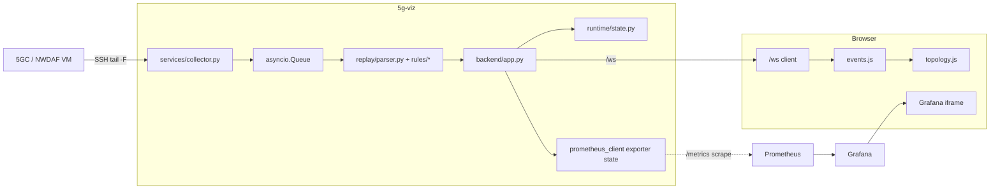
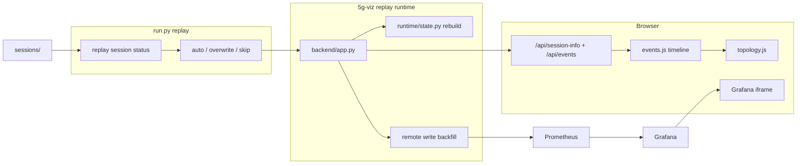

# 5g-viz Architecture

本文用高層視角整理目前 `5g-viz` 的模組結構與外部相依。

若要看更精確的 runtime 流程，請再讀：

- [`system.md`](system.md)
- [`data-flow.md`](data-flow.md)
- [`../backend/api.md`](../backend/api.md)

## 1. 主要外部系統

目前 `5g-viz` 依賴三個主要外部系統：

- 5GC / NWDAF VM
  - live mode 的 log 與事件來源
- Prometheus
  - 持久保存 live scrape 與 replay backfill metrics
- Grafana
  - 以 iframe 嵌入 chart，查詢 Prometheus

## 2. 目前的模組分層

目前 Python runtime 已收斂成四個主要模組群：

```text
run.py
  -> backend/
  -> runtime/
  -> services/
  -> replay/
```

### `run.py`

唯一正式入口。

負責：

- `live`
- `replay`
- `session-status`
- `prom status|delete-session|install-user-service`

### `backend/`

承載 FastAPI app 與 HTTP / WebSocket surface。

主要檔案：

- `backend/app.py`
- `backend/grafana_proxy.py`

### `runtime/`

承載 shared runtime context 與 profile config loader。

主要檔案：

- `runtime/profile_config.py`
- `runtime/runtime_context.py`
- `runtime/state.py`

### `services/`

承載與外部系統或較大功能塊相關的 shared services。

主要檔案：

- `services/collector.py`
- `services/prometheus_service.py`
- `services/replay_session_service.py`
- `services/grafana_setup.py`

### `replay/`

承載 parser 與 session artifact 相關能力。

主要檔案：

- `replay/parser.py`
- `replay/session_io.py`
- `replay/session_import.py`
- `replay/import_logs_cli.py`

### `frontend/`

承載瀏覽器端 UI 與 topology / DVR 邏輯。

主要檔案：

- `frontend/index.html`
- `frontend/events.js`
- `frontend/topology.js`

## 3. Live 架構圖



## 4. Replay 架構圖



## 5. 架構上的關鍵收斂

### 1. Prometheus 不再是 disposable cache

現在 Prometheus 是長駐服務，由 `run.py prom install-user-service` 協助安裝 user service。

`run.py live|replay` 只會：

- 檢查 Prometheus 是否已在跑
- 同步 managed `prometheus.yml`
- 觸發 config reload

### 2. Replay 不再有第二套 chart runtime

目前已不存在：

- `MetricPlayer`
- pseudo-live session
- `/api/replay/play|pause|speed`

replay chart 的 canonical model 是：

- original session
- original session metrics
- absolute 或 historical relative query window

### 3. 設定模型已收斂到 profile YAML

目前主要設定來源是：

- `profiles/<profile>/config.yaml`
- `profiles/<profile>/topology.yaml`

`.env` 已不再是 runtime config source。

## 6. 邊界與責任

### backend

負責：

- 提供 API / WebSocket surface
- session loading
- live queue consumer
- replay backfill

### frontend

負責：

- topology rendering
- DVR state machine
- local replay timeline
- Grafana iframe URL 切換

### Prometheus / Grafana

負責：

- 保存與查詢 metrics
- session-scoped chart rendering

前端不直接查 Prometheus，也不直接理解 PromQL。

## 7. 目前仍屬 historical 的心智

若看到下列名詞，應視為 pre-refactor historical architecture，而不是目前系統：

- `main.py` 作為主 app module
- `start.sh` 作為主要入口
- profile `.env`
- `MetricPlayer`
- pseudo-live session
- replay control mutation APIs
